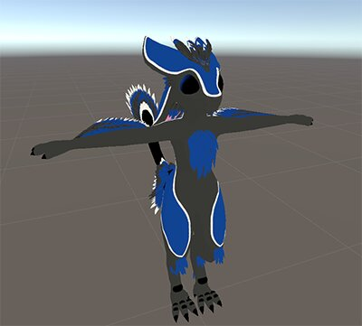
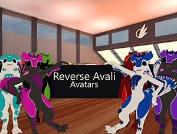
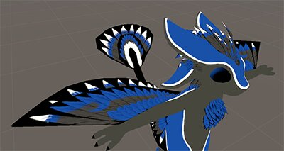

# VRChat Reverse Avali Avatar
### Simple project of a semi Quest compatible Reverse Avali Avatar for VRChat with performance rank medium 
This is a modified Reverse Avali with the base model from VictonRoy https://vrcmods.com/item/5305  
It's fully set up with expressions, emotes and dynamic bones
### Changes from the original
* Optimized UV Map
* Reduced material count to two
* Optional Quest compatible version
* MMD Blendshapes
* Avatar 3 Expressions

You can find a public demo version and some older versions in the [**Reverse Avali Avatar Hall**](https://vrchat.com/home/launch?worldId=wrld_20ff4251-004e-4086-935f-1d1490719001) world in VRChat  

https://vrchat.com/home/launch?worldId=wrld_20ff4251-004e-4086-935f-1d1490719001
## Requirements
* Unity 2019.4.31f1
  * check the VRChat documentation for the current supported version
  * https://docs.vrchat.com/docs/current-unity-version
* Poiyomi Shaders 7.2 or newer
  * https://github.com/poiyomi/PoiyomiToonShader
* VRChat SDK3 for Avatars
  * https://vrchat.com/home/download
#### Optional
* Dynamic Bones
  * https://assetstore.unity.com/packages/tools/animation/dynamic-bone-16743
* Substance Painter 7.2.3 or newer - alternatively a Photoshop PSD compatible program
  * https://www.adobe.com/products/substance3d-painter.html

## How to use
1. Clone or download this repository
2. Open the project in Unity (do not open any scene yet)
3. Import the VRChat SDK
4. Import Poiyomi Shaders
5. Optionally: import Dynamic Bones
6. Open *[Assets] -> [Reverse Avali] -> [Avali Scene]*  
or *[Assets] -> [Reverse Avali] -> [Quest Version] -> [Quest Avali Scene]* for the Quest version
7. if you did **not** import dynamic bones:  
remove the 5 missing scripts on the Avali GameObject (does not apply to the Quest version)
8. Upload using the VRChat SDK  
https://docs.vrchat.com/docs/creating-your-first-avatar

## Customize Textures
In *[Assets] -> [Reverse Avali] -> [Resources~]* (folder does not show up in Unity, use your file browser instead) are
* Substance Painter files
* untested Photoshop files exported from Substance Painter

Colors can be changed by changing the layer fill color

## Quest limitations
The Quest does not support transparency, feathers will show with a black background instead  

## Known issues
* The Quest version needs its own texture instead of reusing the normal one due to decimation and suboptimal topology from the base model
* The FX Layer Controller has an empty mask to prevent the Gesture Layer Controller breaking, this is a workaround for a bug
https://feedback.vrchat.com/avatar-30/p/1017-bug-default-fx-layer-in-client-breaks-gesture-layer-animations-sample-insid
* The right arm puppet is implemented in the action layer instead of gesture layer as a workaround for a bug
https://feedback.vrchat.com/sdk-bug-reports/p/gesture-layers-will-motorcycle-pose-any-masked-humanoid-parts-that-are-not-curre
